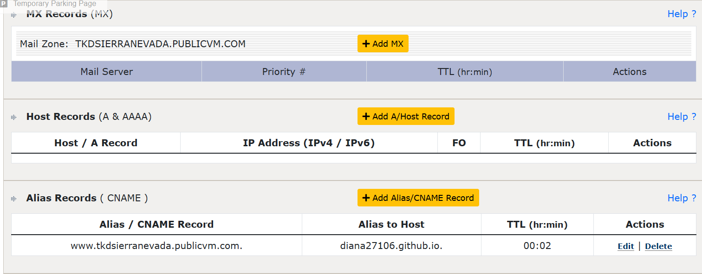
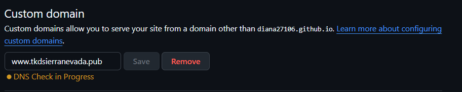
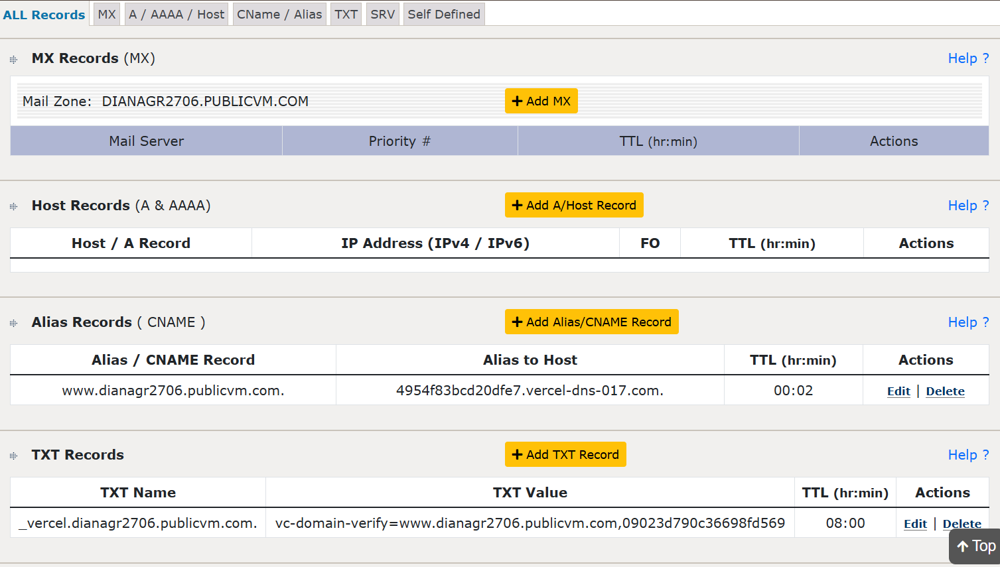
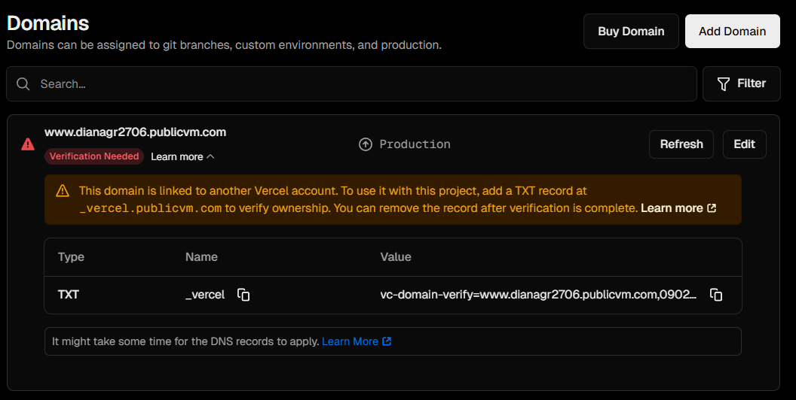
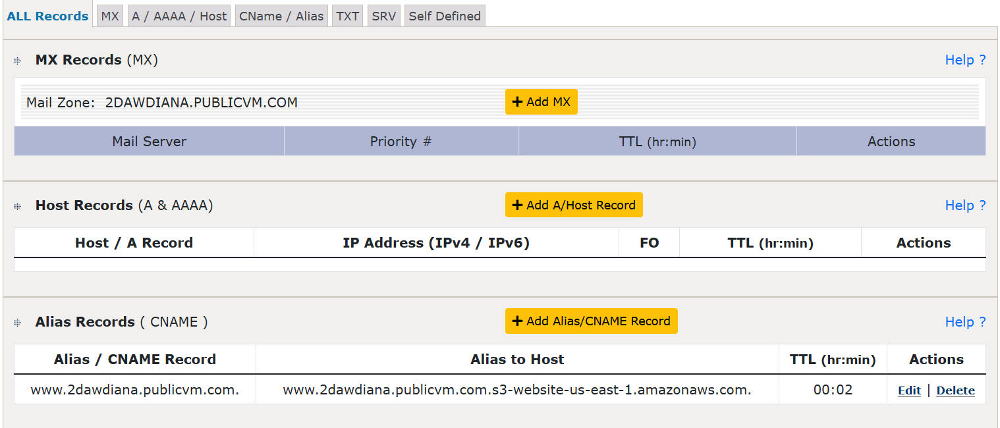
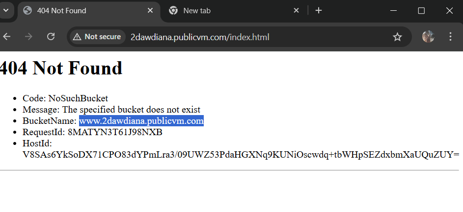

# 🌐 Configuración de DNS con GitHub Pages, Vercel y AWS S3

Este documento describe los pasos, configuraciones y problemas encontrados al configurar **dominios personalizados** con diferentes servicios de hosting: **GitHub Pages**, **Vercel** y **Amazon S3 (AWS)**.

---

## 1. DNS con GitHub Pages usando CNAME

### Configuración

1. En el panel de tu proveedor de dominio, crea un **registro CNAME** apuntando tu dominio personalizado al dominio de GitHub Pages:

📸 _Captura: Tabla de configuración DNS_


1. En el repositorio de GitHub:

   - Ve a **Settings → Pages → Custom domain**
   - Introduce tu dominio personalizado (por ejemplo, `www.tkdsierranevada.publicvm.com`)

📸 _Captura: Configuración de custom domain_


3. Crea el archivo `CNAME` en la raíz del repositorio con el contenido:

```plaintext
www.tkdsierranevada.publicvm.com
```

---

### 🔄 Redirección automática desde `index.html` a `html/home.html`

Para redirigir automáticamente cuando se accede a la raíz del sitio, agrega en el header del archivo `index.html` el siguiente código:

```html
<meta http-equiv="refresh" content="0; url=HTML/home.html" />
```

URL Final: https://www.tkdsierranevada.publicvm.com

---

## 2. DNS con Vercel usando CNAME y TXT

Intento de configuración de dominio personalizado en **Vercel**.

### Configuración DNS

Vercel solicitó los siguientes registros:

| Tipo  | Nombre                        | Valor                         | TTL  |
| ----- | ----------------------------- | ----------------------------- | ---- |
| CNAME | `www.dianagr2706publicvm.com` | `cname.vercel-dns-017.com`    | Auto |
| TXT   | `_vercel`                     | `vc-domain-verify=XXXXXXXXXX` | Auto |

📸 _Captura: Tabla DNS configurada_


### ⚠️ Problema encontrado

El panel DNS **no permitía crear un registro con nombre `_vercel` sin añadir `.tudominio.com`**, lo que provocó que la verificación fallara.

📸 _Captura: Error o warning de vercel_


> **Posible causa:** el nombre del registro debe ser exactamente `_vercel` (sin el dominio completo), y algunos paneles DNS añaden automáticamente el sufijo del dominio.
> **Posible solución:** Crear el registro en el nivel raíz o mediante la opción avanzada de tu proveedor DNS, asegurando que el nombre quede exactamente como `_vercel`.

---

## 3. DNS con Amazon S3

### Configuración

En AWS S3, el **nombre del bucket debe coincidir exactamente con tu dominio**, por ejemplo:

```
www.tudominio.com
```

Luego, se debe **habilitar el hosting estático** y apuntar el DNS al bucket.

| Tipo  | Nombre | Valor                                                  | TTL  |
| ----- | ------ | ------------------------------------------------------ | ---- |
| CNAME | `www`  | `www.tudominio.com.s3-website-us-east-1.amazonaws.com` | Auto |

📸 _Captura: Tabla DNS en AWS_


### ⚠️ Problema encontrado

Inicialmente, el bucket tenía un nombre diferente al dominio, por lo que AWS mostraba un error:

📸 _Captura: Error de nombre del bucket_


> **Solución:** Crear un nuevo bucket con el **mismo nombre que el dominio** y volver a habilitar el hosting estático. Luego funcionó correctamente.

URL Final: http://www.2dawdiana.publicvm.com

---

## ✅ Conclusión

| Servicio     | Estado         | Comentario                       |
| ------------ | -------------- | -------------------------------- |
| GitHub Pages | ✅ Funcional   | CNAME + redirección implementada |
| Vercel       | ⚠️ En revisión | Problema con el TXT `_vercel`    |
| AWS S3       | ✅ Funcional   | Resuelto al renombrar bucket     |
